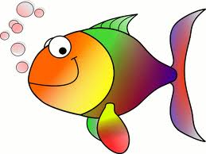
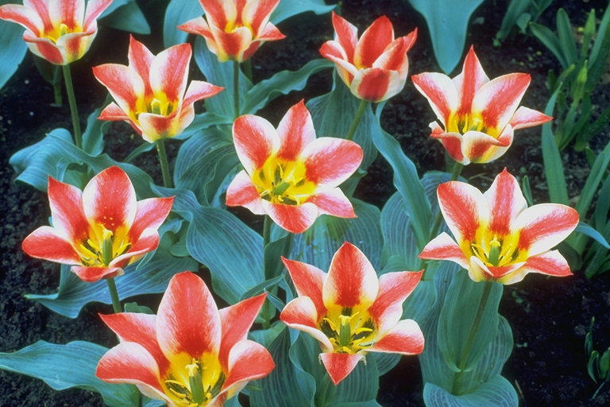

# artscii

Image to ascii art

Transform your image to ascii art, customizable width & height, detail level, color output.

## How to use

Download the binary from the `Release` tab or [Build from source](#build-from-source)

```sh
./path/to/artscii --help
```

## Features

- Multiple charset: 3 set of ascii characters to increase output details.
- Support colored output: 256 color and true color support.
- Auto detect color support: Detect terminal color support with `support-color` crate.
- Customizable: width, height, dimension, output file.

> Note: If you specify weird width and height, the output might be cursed.

## Examples

Examples images and outputs can be found in [examples](./examples/) directory.

Use `cat` tool to see the color!!!

> Because the height of a font is often twice or more than its width.
> You will need to tweak the dimension to make the output looks good.
>
> Site note: If you specify output flag, nothing will be printed out.

| Image | Command used |
|-------|--------------|
| <a href="./examples/HappyFish.jpg"></a> | `cargo run -- ./examples/HappyFish.jpg -ddc -o ./examples/HappyFish.txt` |
| <a href="./examples/lena.bmp"></a> | `cargo run -- ./examples/lena.bmp -o ./examples/lena.txt` |
| <a href="./examples/lena_color_512.tif"></a> | `cargo run -- ./examples/lena_color_512.tif -c partial --dimension 80x32 -o ./examples/lena_color_512.txt` |
| <a href="./examples/tulips.png"></a> | `cargo run -- ./examples/tulips.png --width 69 -dc -o ./examples/tulips.txt` |

## Build from source

> Make sure you have `rustup` installed.

1. Clone the repo

```sh
git clone https://github.com/thqnhz/artscii.git
cd artscii
```

1.5. Run with cargo
```sh
cargo run -- --help
```

2. Build the project

```sh
cargo build --release
```

3. Be patient

4. Run the executable

```sh
./target/release/artscii --help
```

